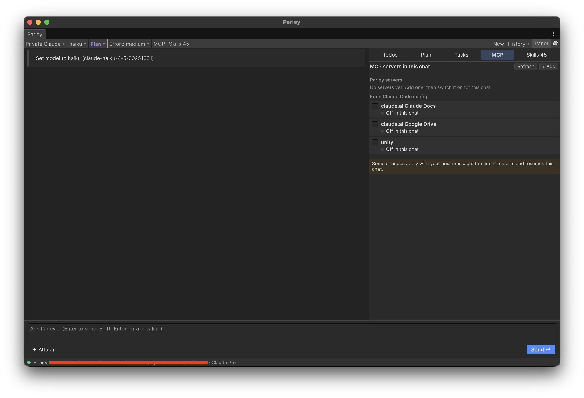
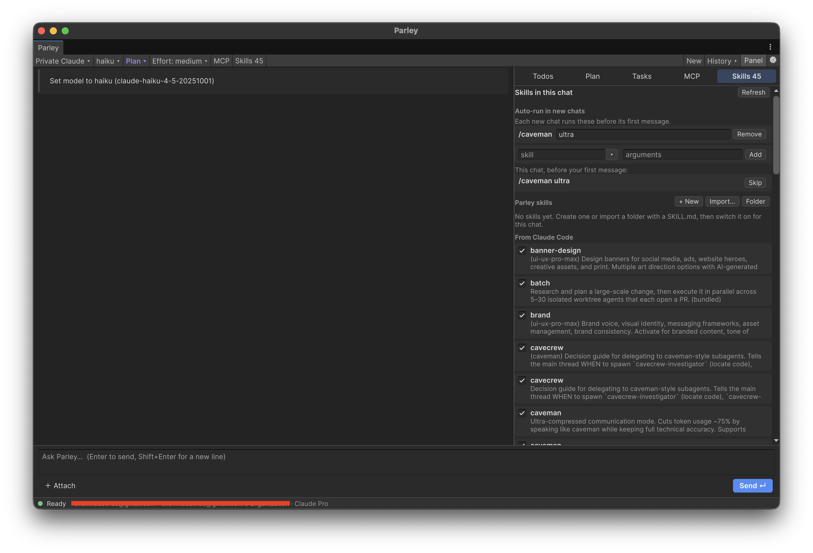
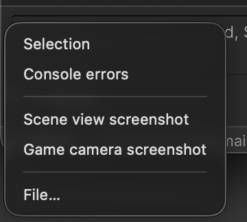

# Parley
[](https://unity.com/releases/editor/archive)

[](https://www.donationalerts.com/r/danilchizhikov)

## Overview
Parley is an AI chat window for the Unity Editor. It works with three kinds of backends:

- **Claude Code.** Parley runs the `claude` CLI as a child process and talks to it over the same stream-json control
  protocol the Claude Agent SDK uses. Every sign-in method Claude Code supports is available: Claude subscription,
  Console, SSO, long-lived OAuth token, API key, LLM gateway, `apiKeyHelper`, Amazon Bedrock, Google Vertex AI,
  Microsoft Foundry and Anthropic profiles.
- **Codex.** Parley runs `codex app-server` and drives it over its JSON-RPC protocol, signed in with ChatGPT or an
  OpenAI API key.
- **Local models.** Parley runs its own agent loop against any OpenAI-compatible server: LM Studio, Ollama,
  llama.cpp, vLLM, or a hosted endpoint. The agent has file, search, shell and web tools, asks before risky actions,
  and supports plan mode and clarifying questions.

All backends share one interface. You get streaming markdown, collapsible thinking, tool cards with diffs, permission
prompts, `AskUserQuestion` cards, plan review, permission modes, todos, background tasks and subagents, interrupt,
resumable sessions, and cost and context usage. Each chat picks its own MCP servers and skills. Parley also exposes
**Unity editor tools** to the agent: console, compiler errors, refresh, selection, hierarchy, inspector values and
project info. You can attach the selection, console errors, a Scene or Game screenshot, or files to a message.



## Table of Contents
- [Getting Started](#getting-started)
    - [Prerequisites](#prerequisites)
    - [UPM Installation](#upm-installation)
- [Features](#features)
- [Usage](#usage)
    - [Open the Window](#open-the-window)
    - [Profiles and Sign-in](#profiles-and-sign-in)
    - [Codex](#codex)
    - [Local Models](#local-models)
    - [Permission Modes](#permission-modes)
    - [Questions and Plans](#questions-and-plans)
    - [Unity Tools](#unity-tools)
    - [MCP Servers](#mcp-servers)
    - [Skills](#skills)
    - [Attachments and Commands](#attachments-and-commands)
    - [Sessions](#sessions)
- [Project Settings and Trust](#project-settings-and-trust)
- [Script Reloads](#script-reloads)
- [Updates](#updates)
- [Where Parley Stores Data](#where-parley-stores-data)
- [Troubleshooting](#troubleshooting)
- [Support](#support)
- [License](#license)

## Getting Started

### Prerequisites
- [Unity](https://unity.com/releases/editor/archive) 6000.0+
- For Claude Code profiles: [Claude Code](https://code.claude.com/docs/en/setup) 2.1 or later
- For Codex profiles: the [Codex CLI](https://github.com/openai/codex) (`npm install -g @openai/codex` or
  `brew install codex`). API-key profiles need 0.162.0 or later
- For local profiles: a server with an OpenAI-compatible `/v1/chat/completions` endpoint that supports tool calling
  (for example LM Studio or Ollama with a model such as Qwen3-Coder)

### UPM Installation
1. Open the manifest.json file in your project's Packages folder.
2. Add the following line to the dependencies section:
    ```json
    "com.dtech.parley": "https://github.com/DanilChizhikov/parley.git",
    ```
3. Unity will automatically import the package.

To pin a release, add its tag: `https://github.com/DanilChizhikov/parley.git#v0.1.0`.

Parley depends on `com.unity.nuget.newtonsoft-json`; Unity installs it automatically.

## Features
- Claude Code backend over the Agent SDK control protocol: tool permission requests, `AskUserQuestion`,
  `ExitPlanMode` plan review, interrupts, permission mode and model switching, and context usage
- Every Claude Code sign-in method, with secrets kept in the OS keychain
- Codex backend over `codex app-server`: approvals, plan mode, reasoning effort, MCP servers and skills, with a
  separate Codex home per profile so your terminal login stays untouched
- A local-model agent with Read, Write, Edit, Glob, Grep, Bash, WebFetch, TodoWrite, AskUserQuestion, EnterPlanMode,
  ExitPlanMode and Skill tools
- Native function calling, or `<tool_call>` text tags for models that lack it
- Streaming markdown with code highlighting, tables, task lists and clickable `path:line` references
- Tool cards with unified diffs for edits and collapsible output
- Subagent output nested under its Agent tool card
- Side panel with the latest plan, todos, background tasks (with a Stop button), and this chat's MCP servers and
  skills
- Unity editor tools served to Claude Code as an in-process MCP server (`mcp__unity__*`), to Codex as dynamic tools,
  and to local models natively (`unity_*`)
- Per-chat MCP servers: your own library (stdio or HTTP) plus the servers from the Claude Code or Codex config
- Per-chat skills: your own `SKILL.md` library plus the skills the CLI finds, and skills that run automatically
  before the first message of every new chat
- Attachments: selection, console errors, Scene view or game camera screenshots, files, and drag & drop
- `/` command autocomplete and `@` asset path completion
- Sessions saved per project, which you can resume after a script reload or an editor restart
- Script reloads are deferred while the agent works, so recompiling doesn't kill the turn
- An update notifier in the toolbar with release notes and one-click update

## Usage

### Open the Window
Use `Window/DTech/Parley`. The toolbar holds the profile, model, permission mode and effort selectors, the **MCP** and
**Skills** buttons, plus **New**, **History**, **Panel** and preferences. Press Enter to send and Shift+Enter for a
new line. While the agent works, Send queues your message and **Stop** interrupts the turn.

**Panel** toggles the side panel. Its tabs are **Todos**, **Plan**, **Tasks**, **MCP** and **Skills**.

### Profiles and Sign-in
Profiles live in `Preferences/DTech/Parley`. Parley starts with a Claude Code profile, a Codex profile and two local
ones (LM Studio and Ollama). Add, duplicate or delete profiles there. Changes apply to chats you start afterwards.

| Sign-in method | What Parley does |
|---|---|
| Claude Code default | Uses whatever the CLI is already signed in with |
| Claude subscription / Console / SSO | Runs `claude auth login --claudeai / --console / --sso` and shows the sign-in link and a field for the code. **Sign in (Terminal)** runs the same command in a terminal window |
| Long-lived OAuth token | **Generate token…** runs `claude setup-token` and saves the printed token. You can also paste a token. Passed as `CLAUDE_CODE_OAUTH_TOKEN` |
| API key | `ANTHROPIC_API_KEY` |
| LLM gateway / custom endpoint | `ANTHROPIC_BASE_URL` + `ANTHROPIC_AUTH_TOKEN` (+ custom headers). Presets point Claude Code at Ollama (0.14+) or LM Studio (0.4.1+) through their Anthropic-compatible APIs |
| apiKeyHelper | Passed through `--settings` |
| Amazon Bedrock | `CLAUDE_CODE_USE_BEDROCK`, region, and an AWS profile, access keys or a Bedrock API key |
| Google Vertex AI | `CLAUDE_CODE_USE_VERTEX`, `CLOUD_ML_REGION`, `ANTHROPIC_VERTEX_PROJECT_ID`, optional credentials file |
| Microsoft Foundry | `CLAUDE_CODE_USE_FOUNDRY`, resource or base URL, API key or Entra ID |
| Anthropic profile | `ANTHROPIC_PROFILE` |

Any Claude profile can set a **Config dir** (`CLAUDE_CONFIG_DIR`). This keeps separate accounts apart, and logins for
that profile are stored there. For every method except *Claude Code default*, Parley removes inherited credential
variables that the profile doesn't set. Without that, Claude Code's credential precedence could pick a different
login than the one you chose. **Check status** runs `claude auth status`.

Secrets go to the macOS Keychain, the Windows Credential Manager, or Secret Service (`secret-tool`) on Linux. If
`secret-tool` is missing, they go to a `0600` file in `~/.config/dtech-parley`. They are never written to project or
settings assets, and reach the CLI only through environment variables.

### Codex
A Codex profile signs in one of two ways:

| Sign-in method | What Parley does |
|---|---|
| Codex default | Uses the ChatGPT sign-in or API key Codex already has. **Sign in (Terminal)** runs `codex login`, **Sign in with device code (Terminal)** runs `codex login --device-auth`, and **Sign out (Terminal)** runs `codex logout` |
| OpenAI API key | The key is kept in the OS keychain and handed to Codex with credentials that are never written to disk |

Codex runs with its own home folder (`Library/Parley/Codex/<profile id>`) unless you set **Config dir**
(`CODEX_HOME`), so your terminal login stays untouched. **Check status** runs `codex login status`. **Extra CLI
arguments** are appended to `codex app-server`.

### Local Models
Pick a server preset (LM Studio, Ollama, llama.cpp, vLLM, or a custom OpenAI-compatible server) or enter a base URL
that ends in `/v1`. Then use **Test connection** and **Pick…** to choose a model. Set the context window to match the
server's setting; Parley trims old tool output, then old turns, to stay inside it. `/compact` summarizes the
conversation and `/clear` forgets it. Turn on **Vision** for models that accept images. Turn on **Text tool calls**
when the server or model has no native function calling.

The local agent reads project instruction files such as `CLAUDE.md`, `AGENTS.md` and `CODEX.md` from the project root
(you can switch this off) and the project's extra instructions.

### Permission Modes
| Mode | Behaviour |
|---|---|
| Ask before edits | Reads run freely; edits, shell commands and network calls ask first |
| Accept edits | File edits inside the project run without asking |
| Plan | Read-only exploration; the agent finishes with a plan for you to review |
| Auto (Claude Code) | Claude Code's classifier decides |
| Bypass permissions | Everything runs without asking. Parley asks you to confirm before switching |
| Don't ask | Anything that would ask is denied |

For Codex, each mode maps to an approval policy and a sandbox: *Ask before edits* and *Plan* run read-only, *Accept
edits* allows writes inside the workspace, and *Bypass permissions* gives full access. Codex has no *Auto* mode.

A permission card offers **Allow once**, **Always allow**, **Deny**, or **Deny with feedback**. For Claude Code,
**Always allow** applies Claude's suggested rule. For local models, it remembers the rule for this project: a command
prefix, file edits, or a host. The rule is shown on the button.

### Questions and Plans
When the agent calls `AskUserQuestion`, a card shows each question with its options. Questions can be single or
multiple choice, include an *Other* field, and show option previews when the model provides them. You can also reply
in your own words instead. In plan mode the agent presents its plan with `ExitPlanMode`. You can **Approve ·
auto-accept edits**, **Approve · review each edit**, **Approve · bypass permissions**, or **Keep planning** with
feedback. The latest plan stays in the side panel.

When Claude Code runs in restricted mode (`CLAUDE_CODE_RESTRICTED=1` or `--restricted`), Parley hides the *Bypass
permissions* mode and the matching plan button.

### Unity Tools
| Tool | Purpose |
|---|---|
| `console` | Console errors, warnings and logs, with an optional filter and stack traces |
| `compile_status` | Whether scripts are compiling, plus current compiler errors |
| `refresh` | Refreshes the AssetDatabase, waits for compilation, reports errors |
| `selection` | Selected assets and scene objects |
| `hierarchy` | Scene or prefab hierarchy with components |
| `inspect` | Serialized properties of an object, asset or the selection (read-only) |
| `project_info` | Unity version, build target, scripting backend, render pipeline, build scenes, packages |

The agent may use the read-only Unity tools without asking. You can switch each tool off in the preferences.

### MCP Servers
The **MCP** tab of the side panel lists the MCP servers of the current chat. Each one has a checkbox that switches it
on or off for this chat only, and shows whether it is connected, failed or needs a sign-in.

- **Parley servers** are your own library. **+ Add** creates one: a name, a transport (stdio command with arguments
  and environment variables, or an HTTP URL with headers), and whether new chats use it by default. Secret values are
  kept in the OS keychain. The library is shared by all your projects.
- **From Claude Code config** / **From Codex config** lists the servers the CLI already knows about, so you can turn
  them off for a chat without editing the CLI config.

Local models talk to MCP servers through Parley's own MCP client. Every MCP tool asks before it runs there, whatever
the server claims about it. Some changes apply with your next message: the agent restarts and resumes the chat.

### Skills
The **Skills** tab lists the skills of the current chat, each with a checkbox for this chat.



- **Parley skills** are your own library of `SKILL.md` folders. **+ New** writes one (name, description, argument
  hint and instructions, where `$ARGUMENTS` is replaced with the arguments), **Import…** copies a folder that contains
  a `SKILL.md`, and **Folder** reveals the library.
- **From Claude Code** / **From Codex** lists the skills the CLI finds. Local models read `.claude/skills` and
  `.agents/skills` from the project and your home folder (**From skill folders**).
- **Auto-run in new chats** is a list of skills, each with optional arguments, that every new chat runs before its
  first message (for example `/caveman ultra`). A chat keeps the list it started with; **Skip** drops an entry for
  this chat only.

Claude Code runs each auto-run skill as a separate turn, so skill hooks see it. Codex receives skills as `skill`
input items. Local models get the skill text inline and can load more with their Skill tool.

### Attachments and Commands


**＋ Attach** adds the selection, console errors, a Scene view or game camera screenshot, or a file. You can also
drag assets, files or scene objects onto the composer. Type `/` for the backend's commands and skills, or `@` to
complete an asset path.

### Sessions
Parley saves each chat under `Library/Parley/Sessions`, with its MCP servers and skills. **History** resumes a chat:
Claude Code continues with `--resume`, Codex resumes its thread, and local chats restore their message history.
Parley reopens the last chat after a script reload or an editor restart.

## Project Settings and Trust
The **This project** section of the preferences holds options shared through version control in
`ProjectSettings/ParleySettings.asset`: extra instructions, extra instruction files, extra directories the agent may
access, and the Unity tools. When that file changes outside Parley, for example after a pull, Parley ignores the
values until you press **Trust**. Trusting applies to chats started afterwards.

## Script Reloads
When the agent edits C# files, Unity recompiles, and the assembly reload that follows would kill the CLI process and
stop the local agent. By default Parley holds `EditorApplication.LockReloadAssemblies` while a turn runs. Compilation
and the `refresh` tool's error report still work, and the reload happens as soon as the turn ends. After a turn that
edited files, Parley refreshes the AssetDatabase. You can turn the lock off in the preferences (**Defer script reload
while the agent works**).

## Updates
Once per editor session Parley checks for a newer release: a Git tag on GitHub, or a newer version in the registry
when the package was installed from one. When there is one, the toolbar shows a green **Update Available** dropdown:

- **What changed** shows the release notes of every version newer than yours.
- **Update** updates the package through the Package Manager. Unity then recompiles scripts, which interrupts running
  chats.

## Where Parley Stores Data
- `Preferences/.../DTech/Parley/Settings.asset`: profiles (no secrets), MCP server library, skill settings, window
  state, per-project allow rules
- `Preferences/.../DTech/Parley/Skills/.claude/skills`: your skill library
- `ProjectSettings/ParleySettings.asset`: shared project options (extra instructions, extra directories, Unity tools)
- `Library/Parley/Sessions`: saved chats
- `Library/Parley/Codex`: per-profile Codex homes
- `Library/Parley/run`: generated `--mcp-config` / `--settings` files for the CLI
- OS keychain (or `~/.config/dtech-parley/credentials.json`): secrets

## Troubleshooting
- **Claude Code or Codex CLI not found.** Unity started from the Dock doesn't see your shell's `PATH`. Parley searches
  the usual install locations and asks your login shell. You can also set the path in the preferences and use
  **Detect** to check it.
- **Sign in doesn't finish inside Unity.** Use **Sign in (Terminal)**, then **Check status**.
- **A Codex API-key profile fails to start.** Update Codex to 0.162.0 or later.
- **An MCP server needs a sign-in.** For Claude Code, run `/mcp` in Claude Code; for Codex, run `codex mcp login`.
- **A local model never calls tools.** Use a model with tool support, or turn on **Text tool calls**.
- **Hooks, MCP servers or `node` fail under Claude Code.** Parley passes your login shell's `PATH` to the CLI. Make
  sure those tools are on it.

## Support
Parley is free and MIT-licensed. If it saves you time and you would like to help it grow, you can support its
development on [DonationAlerts](https://www.donationalerts.com/r/danilchizhikov).

It is entirely optional: bug reports, ideas and pull requests help
just as much.

## License
MIT. See [LICENSE](LICENSE).
